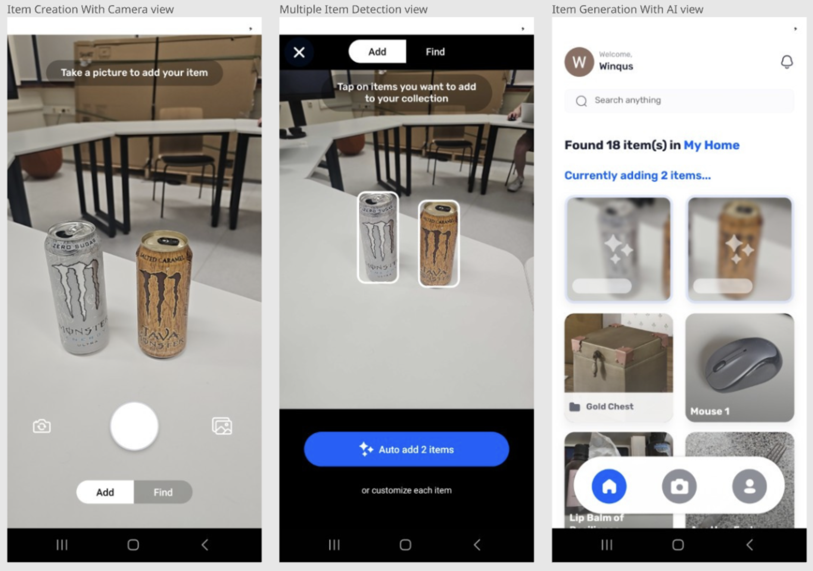
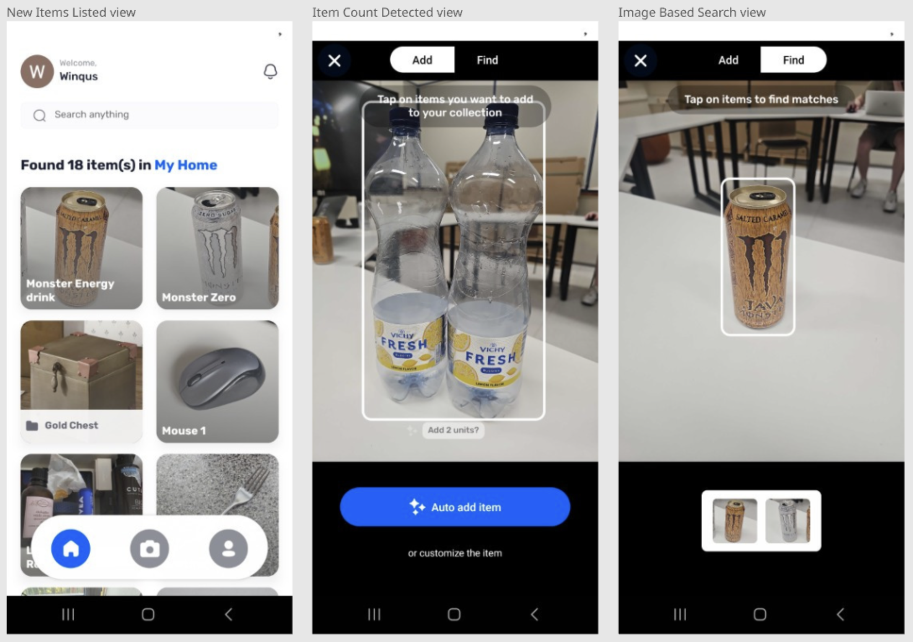

# Korbis

AI-driven item organization system for personal and friend needs to help sort and search through personal belonging like electronics and any other items.

Built with React Native, MLKit, Express.js, Weaviate vector DB and Supabase.

## App Features
Google sign-in, items list and item details views:

Item update, manual creation and search views:

Item creation with camera and AI, multiple item detection and description generation:

New items listed after creation, automatic item counting, image based search:

## Demo Video

<video src="https://github.com/user-attachments/assets/9d0e5ea5-ad2b-4f43-a470-e55588ccb71a" width="auto" height="auto" controls></video>

